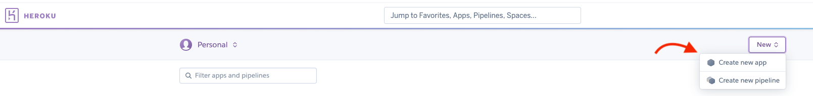
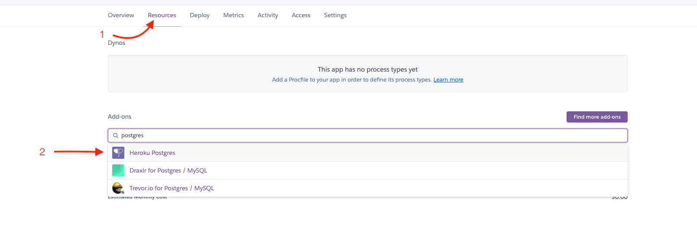
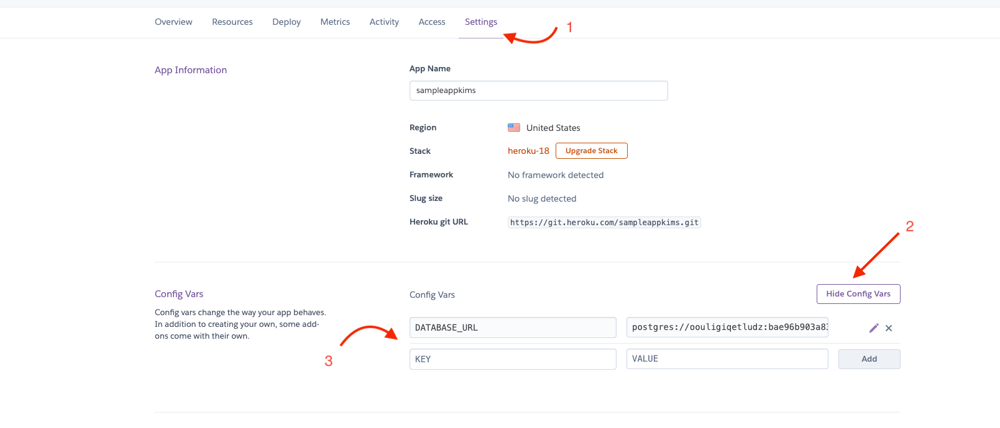
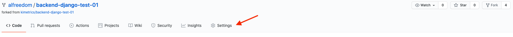
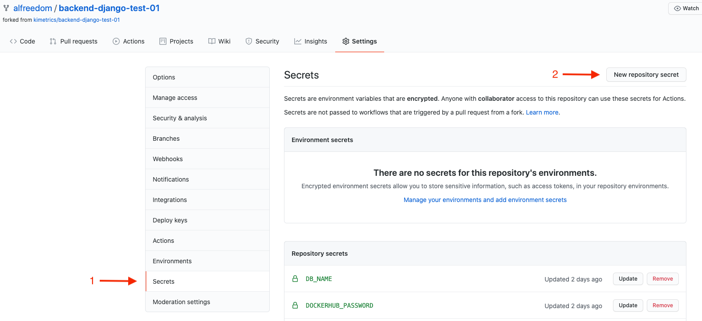
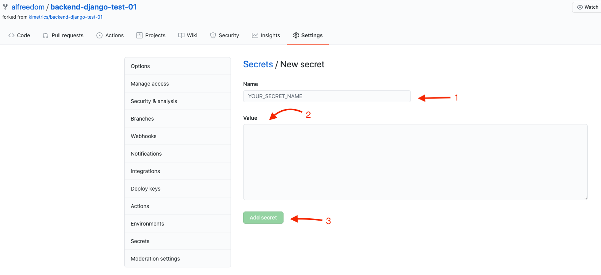

# Deploying using Github Actions and Heroku

The CI/CD workflow is made with Github Actions, allowing running pipelines
on push in every branch of the repository. The pipeline run the tests of the django
application with a postgresql container, build the Docker image, push it to Docker hub and
perform the deploy into a container based application in Heroku.

The test pipeline works on every branch. 
The Docker build is performed when a push in the master/main branch or when a new tag is
pushed too, but only push the image built in Docker Hub when a push operation of a tag is made.
The deployment on Heroku is only made when a push on main/master branch.

## Deploy requirements

- An application created in Heroku
- A github repository
- An application created in Docker hub
- Docker and Docker Compose installed in local machine for development.

## Information required

- Heroku API token
- Heroku App name
- Docker Hub repository name
- Docker Hub username and password
- PostgreSQL database credentials

## Steps to deploy

### 1 - Create an set-up application in Heroku

- Create an account or loggin in to Heroku if you already has an account
- Create a new application:

  
- In the app dashboard select the *Resources (1)* menu option and in the *Add-ons* section search 
for *postgres*, then select the add-on *Heroku Postgres (2)*:
  

- Now, we neet to add the environment variables for the application in the Heroku app, to do this
just need to going to the app *Settings (1)* in the menu, click on the button *Show vars* in the
*Config Vars* section and add the the pairs KEY-VALUE that you need.
  

Heroku automatically add the *DATABASE_URL* var when add the *Postgres Heroku* add-on. For this
Django application we need to set the nex Config Vars that will be used as environment variables into the application:

- ALLOWED_HOSTS: The url/domain for the heroku app, eg. myapphttps.herokuapp.com
- SECRET_KEY: The django secret key
- DEBUG: True or False
- DJANGO_MIGRATIONS: True or False
- DJANGO_COLLECTSTATIC: True or False

### 2 - Create a docker hub account and repository

This part is optional and only is needed if you want to push the Docker image built in the CI/CD workflow.

Once an account was created, you need the repository name the unsername for Docker Hub and your password. This credentiasl
will be used in the set-up of Github repository.

### 3 - Set-up the Github repository to run actions

To allow github actions to push image in Docker hub and deploy de application in heroku, we need to configure the
credentials, api key and other variables to be used by the workflow. To do this we need to define de varibles as secrets
into the github repository.

- Select *Settings* in the repository menu:

- Clic on *Secrets (1)* menu option and in *New repository secret (2)* button:

- Create a new secret writting its name (1) and its value (2), then clic in the *Add secret (3)* button:

- The secretes that de workflow needs are:

    - DOCKERHUB_USERNAME
    - DOCKERHUB_PASSWORD
    - DOCKERHUB_REPOSITORY
    - HEROKU_APP_NAME
    - HEROKU_API_KEY
    
### 5 - Test workflows and deployment

To make sure that the github actions and workflows works correctly, it's necesary to do a push on any branch to run the
django tests, push a tag (eg. v0.1.0) on nay branch to test the docker image build and push to Docker Hub, and do a pus
to the main/master branch to deploy in heroku.